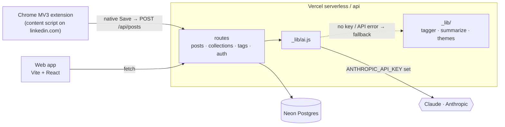

# LinkedIn Saver

**[Live demo](https://linkedin-saver.vercel.app)** (password-protected) · **[Case study](CASE_STUDY.md)** · MIT licensed

A **save-and-classify** tool for LinkedIn posts — like Raindrop.io, but it
**suggests tags, writes one-line summaries, and clusters your saved posts into
themes** using **Claude** (Anthropic). Set `ANTHROPIC_API_KEY` to turn the AI on;
with no key it transparently falls back to fast offline heuristics, so the app
always works.

Deployed on **Vercel**: a Vite + React frontend, serverless functions in `/api`,
and **Neon Postgres** for storage.

> **Why it exists.** LinkedIn's Saved list is chronological, unsearchable, and
> untaggable — saving a post is effectively losing it. The value isn't in *saving*;
> it's in *re-finding the right post weeks later*. So the structure (tags, summaries,
> themes) has to appear automatically at capture time. More in the [case study](CASE_STUDY.md).

| Part | What it does | Stack |
|------|--------------|-------|
| `src/` | Review posts, accept/edit tags | Vite + React |
| `api/` | Store posts, suggest tags | Vercel serverless functions |
| `api/_lib/` | DB layer + heuristic tagger | `@neondatabase/serverless` |
| `extension/` | Auto-capture on LinkedIn native Save | Chrome MV3 |

## Architecture



The AI layer and the offline heuristics return the **same response shape**, so the
fallback is invisible to the rest of the app — it works with or without a key.

## Deploy

```bash
npm install
vercel link            # link to / create the Vercel project
# Connect a Neon Postgres store in the Vercel dashboard
#   Storage → Create → Neon  (injects POSTGRES_URL automatically)
vercel --prod          # deploy
```

The schema is created automatically on first request (idempotent
`CREATE TABLE IF NOT EXISTS`), so there's no migration step.

## Shipping changes

When a feature or fix is ready, commit and push the current branch with:

```bash
npm run ship -- "Short feature/fix summary"
```

The ship command runs the production build, stages local changes, creates a
commit with the supplied message, and pushes the current branch to `origin`.
It refuses to push directly from `main` or `master` unless `SHIP_ALLOW_MAIN=1`
is set.

## Local development

```bash
npm install
vercel env pull        # pull POSTGRES_URL / DATABASE_URL into .env
vercel dev             # frontend + /api functions on http://localhost:3000
```

Open http://localhost:3000 and paste a post to try the **save → suggest → accept**
loop. `vercel dev` runs the same serverless functions you deploy.

## Browser extension

1. Chrome → `chrome://extensions` → enable **Developer mode** → **Load unpacked** → `extension/`.
2. Click the extension icon, set **App server URL** to your Vercel URL (or
   `http://localhost:3000` for local dev), password if configured, and **Save settings**.
3. On linkedin.com, use LinkedIn’s built-in **Save** on any feed post — it is sent to your app automatically.

### Auto-reload while editing the extension

Vercel deploys the web app only; Chrome still runs your local unpacked extension. To reload it on save:

```bash
npm run ext:watch
```

Keep that terminal open. After you change any file under `extension/`, the watcher reloads the extension and refreshes open LinkedIn tabs. Reload the unpacked extension once after pulling this feature so `dev-reload.js` is picked up.

> The content script reads LinkedIn’s DOM, whose class names change often. If auto-capture stops working:
> 1. Open DevTools on a feed post and inspect the native **Save** button (`aria-label`, action bar classes).
> 2. Update selectors in [`extension/lib/extract.js`](extension/lib/extract.js) (post text/author) and [`extension/native-save.js`](extension/native-save.js) (save button detection).
> 3. Confirm the popup shows a connected server and the correct password (`/api/session`).

## How tag suggestion works

With `ANTHROPIC_API_KEY` set, [`api/_lib/ai.js`](api/_lib/ai.js) asks **Claude**
to tag each post against this taxonomy, reusing your existing vocabulary so the
tag set stays consistent:

- `author`: who wrote the post (one canonical `author: name` label).
- `topic`: what the post is about.
- `format`: post, article, video, carousel, link, event.
- `source`: LinkedIn, newsletter, company site, publication.
- `intent`: inspiration, reference, lead, follow-up, idea, read later.

With **no key (or on any API error)** it falls back to the pure local heuristics
in [`api/_lib/tagger.js`](api/_lib/tagger.js), ranked: author label → hashtags →
existing-vocabulary matches → frequent phrases/keywords (URL/domain/name noise
filtered out). The AI and heuristic functions return the exact same shape, so
the rest of the app is unchanged either way.

### Configuration

| Env var | Required | Default | Purpose |
|---------|----------|---------|---------|
| `ANTHROPIC_API_KEY` | no | — | Turns on AI tags, summaries, and themes. Unset ⇒ offline heuristics. |
| `ANTHROPIC_MODEL` | no | `claude-haiku-4-5-20251001` | Override the Claude model. |
| `AI_DEBUG` | no | — | Set to `1` to log when a call falls back to the heuristic. |

Add `ANTHROPIC_API_KEY` in the Vercel dashboard (Settings → Environment
Variables) for the deployed app, and to your local `.env` for `vercel dev` and
the export script.

## Export: themed page + spreadsheet

Turn your saved posts into two shareable artifacts — offline, no LLM, no extra
deps:

```bash
npm run export -- --input posts.json        # array of post objects
npm run export -- --input export.csv         # the app's own CSV export
vercel env pull && npm run export            # straight from Postgres
```

Writes to `./export/` (override with `--out <dir>`):

- **`linkedin-saved-posts.html`** — a single self-contained page (open by
  double-click, works offline): full-text search, theme filters, sort, and
  expandable cards. Holds a short excerpt + one-line summary per post.
- **`linkedin-saved-posts.xlsx`** — one row per post on a **Posts** sheet
  (incl. the full text) plus a **By Theme** sheet grouped by cluster.

The summaries and themes use **Claude** when `ANTHROPIC_API_KEY` is set, and fall
back to the offline, deterministic engines otherwise:

- `api/_lib/ai.js` — Claude-powered summaries (batched) + theme clustering, each
  wrapping the heuristic below as a fallback.
- `api/_lib/summarize.js` — lead-sentence one-line summaries (fallback).
- `api/_lib/themes.js` — hashtag-weighted, document-frequency clustering into
  ~6–10 named themes (fallback).

To produce `posts.json` from a deployed instance:
`curl -s https://<your-app>/api/posts -H "cookie: <session>" > posts.json`.

## Scope (v1)

Built: save a post → see suggested tags → accept / reject / add. Manual paste + extension auto-capture on LinkedIn Save.
Deferred (schema already supports them): browse/filter by tag, tag management, collections.
