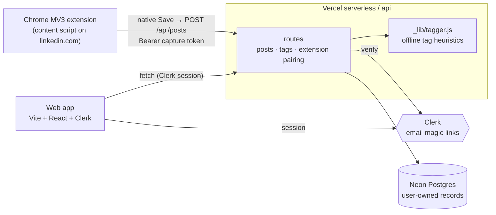

# LinkedIn Saver

**A private, searchable library for the LinkedIn posts you save.** Keep using
LinkedIn's own **Save** button — LinkedIn Saver captures the post into your
account with suggested tags, so you can actually re-find it weeks later.

**Status: hosted private beta.** The app runs at
[linkedin-saver.vercel.app](https://linkedin-saver.vercel.app); sign-ups are
invite-only, and the Chrome extension ships through an unlisted Chrome Web
Store link shared with invitees. The repository is public and MIT-licensed —
see [Case study](CASE_STUDY.md) for the product story.

## Using the beta (invited users)

No Vercel account, database, API key, or Chrome developer mode required:

1. **Sign in with your email.** Enter your invited email address on the site
   and click the magic sign-in link you receive (passwordless, via Clerk).
2. **Install the extension** from the unlisted Chrome Web Store link in your
   empty library / invite.
3. **Connect once.** The extension popup explains what is captured and, after
   your consent, pairs itself with your account using a revocable, capture-only
   credential. No LinkedIn password or session is ever stored.
4. **Save normally.** On linkedin.com, press LinkedIn's built-in **Save** on
   any post — it lands in your private library with suggested tags. Find it
   later with full-text/author search or tag filters, and export to CSV from
   Settings anytime.

If the extension gets disconnected it tells you and offers a one-click
reconnect; failed captures show a clear error and are never silently retried.

## Data and privacy

The extension captures a post's visible text, author/source details, links,
media references, and timestamps **only when you press Save** — nothing else.
Your library is private per account, encrypted in transit, never used for
advertising, and never sold. You can export CSV, revoke the extension, or
permanently delete your account in Settings. Full details:
[PRIVACY.md](PRIVACY.md).

## Demo

Save a post on LinkedIn → it appears in your library with suggested tags →
search or filter to re-find it.

<!-- TODO: add capture → library → search screenshots/GIF before the Store
submission (see docs/chrome-web-store-checklist.md). -->

## Architecture

A Vite + React frontend and Vercel serverless functions in `/api`, backed by
Neon Postgres. Clerk owns authentication (email magic links only); every data
record is owned by a user, and the API resolves the signed-in user server-side
and scopes every read and write to that user.



| Part | What it does | Stack |
|------|--------------|-------|
| `src/` | Library, search, tag filters, Settings | Vite + React + Clerk |
| `api/` | Owned posts/tags, extension pairing, CSV export | Vercel serverless functions |
| `api/_lib/` | DB layer + offline heuristic tagger | `@neondatabase/serverless` |
| `extension/` | Capture on LinkedIn's native Save | Chrome MV3 |

Tag suggestions in the hosted beta use the offline heuristics in
`api/_lib/tagger.js` (author label → hashtags → existing-vocabulary matches →
frequent phrases); no AI key is required or used.

## Contributor / self-hosted setup (advanced)

Self-hosting is **not** the normal user path — it's for contributors and
tinkerers. See [CONTRIBUTING.md](CONTRIBUTING.md) for the full guide.

```bash
npm install
cp .env.example .env.local   # fill in your own Neon + Clerk values
vercel dev                   # frontend + /api on http://localhost:3000
npm test
npm run build
```

If you are migrating a pre-account (single-user) database, assign the existing
records to a founder account once:

```bash
FOUNDER_USER_ID=<clerk_user_id> npm run migrate:multi-account
```

The migration is idempotent — running it twice changes nothing the second time.

## Extension development and packaging

1. Chrome → `chrome://extensions` → enable **Developer mode** →
   **Load unpacked** → `extension/`.
2. The extension's backend origin is fixed in `extension/config.js`
   (`https://linkedin-saver.vercel.app`). Self-hosters change `appOrigin`
   there before loading or packaging.
3. `npm run ext:watch` auto-reloads the unpacked extension (and open LinkedIn
   tabs) whenever a file under `extension/` changes.
4. `npm run extension:package` builds `linkedin-saver-extension.zip` for the
   Chrome Web Store (dev-only files excluded). Don't commit the ZIP. The
   submission steps live in
   [docs/chrome-web-store-checklist.md](docs/chrome-web-store-checklist.md).

> The content script reads LinkedIn's DOM, whose class names change often. If
> capture stops working, inspect the native **Save** button on a feed post and
> update the selectors in [`extension/lib/extract.js`](extension/lib/extract.js)
> and [`extension/native-save.js`](extension/native-save.js).

## License and security

- [MIT License](LICENSE).
- Security reports: use GitHub's
  [private security-advisory form](https://github.com/EgorDranev/linkedin-saver/security/advisories/new)
  — see [SECURITY.md](SECURITY.md).
- Privacy policy: [PRIVACY.md](PRIVACY.md).
- Everything else: [issues](https://github.com/EgorDranev/linkedin-saver/issues).
